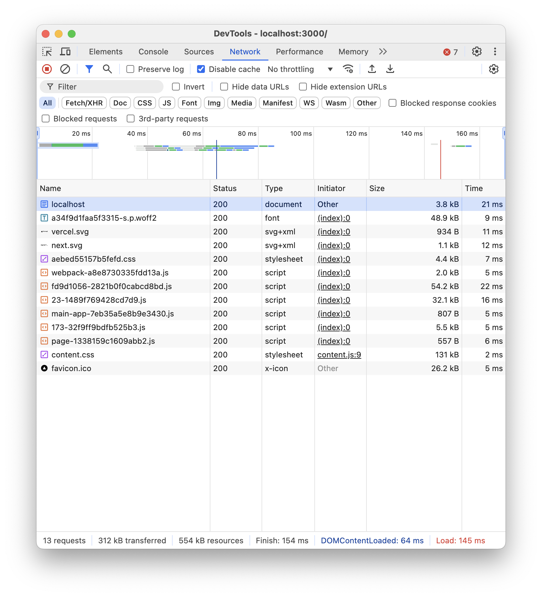
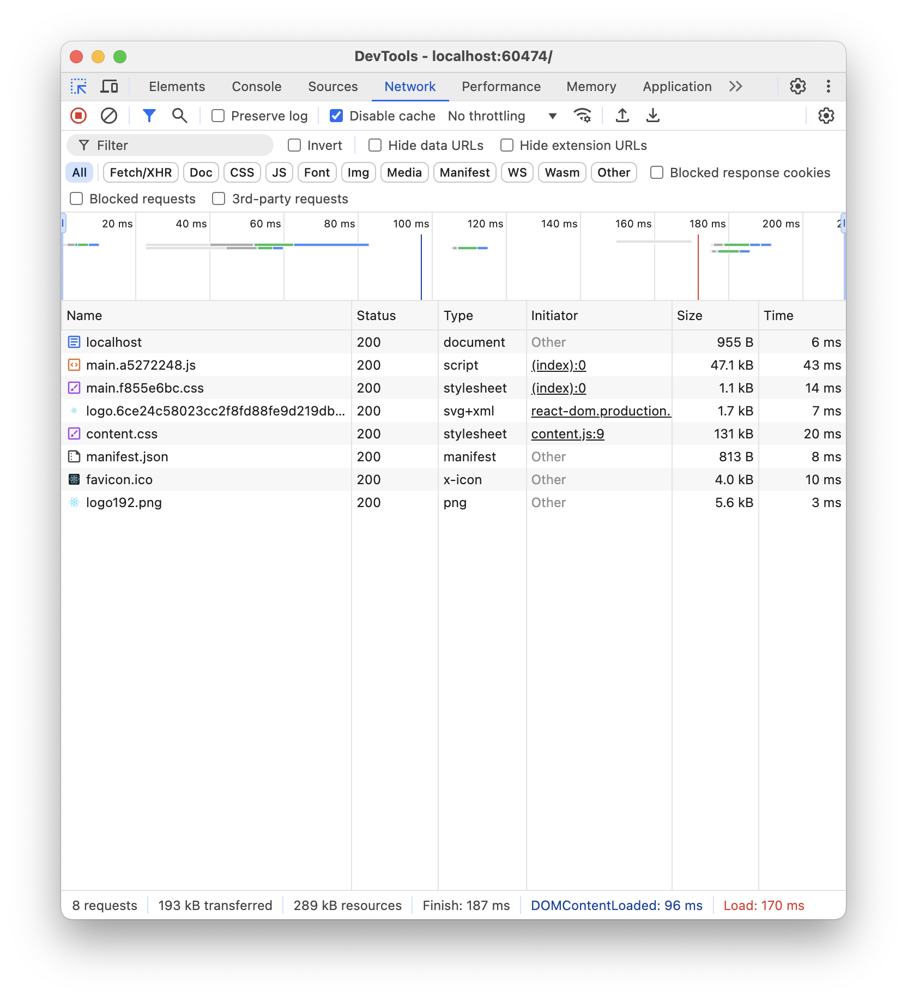

CSR SSR 세션에서는 웹 페이지를 렌더링 하는 방식을 설명할 것이다.

CSR은 Client Side Rendering의 약자이다.
단어 자체의 의미에서 알 수 있듯이 클라이언트 측에서 렌더링을 한다.
무엇을 렌더링할까?
당연히 웹 페이지를 렌더링 한다.

그렇다면 웹 페이지에 필요한 데이터들은 뭐가 있을까?
일반적으로 HTML, CSS, JS 파일이 있다. CSR이나 SSR이나 결국 이 세가지 내용을 담고있는 파일들을 가져와야한다.
다만 무엇을 어떻게 가져오는 것에서 차이가 발생한다.

혹시 Virtual DOM을 알고있는가?
버츄얼 돔은 말 그대로 가상의 Document Object Model을 말한다.
Document Object Model은 우리가 많이 알고 있는 트리 형태의 HTML 코드들이라고 생각할 수 있다.

그럼 가상의 DOM은 무엇을 어떻게 사용할까?
가상의 DOM은 일반적으로 자바스크립트로 만든 객체에 트리 구조를 동일하게 만들어준다.
이 가상의 DOM을 통해서 우리는 HTML에 javascript로 접근해서 인위적으로 만든 트리 구조의 형태 그대로 DOM을 만들어 줄 수 있다.
이렇게 되면 굳이 HTML에 코드를 작성하지 않아도 DOM 트리를 만들 수 있다.

이 방식이 CSR 우리가 많이 사용하는 React js다.
CSR을 응용하면 어플리케이션의 UX를 크게 개선할 수 있다. 초기에 모든 UX에 필요한
자바스크립트들을 가져오면서 화면이 동시에 띄워지기에 유저는 화면이 나오는 동시에
모든 기능을 이용할 수 있다.

하지만 그에따른 단점도 명확히 존재한다.
만약 CSR로 만든 어플리케이션이 엄청나게 커졌다면 그에 따른 js 파일을 가져오기까지에 시간이 늘어날 것이다.
CSR의 특성상 js 파일을 가져와야 화면이 동작하고 어플리케이션을 사용할 수 있기 때문에
프로젝트의 크기와 최적화에 따라서 UX가 좋아지지 않는 경우가 있을 수도 있다.

또한 검색 엔진의 크롤링에 있어서도 불리한 점이 존재한다.
검색 엔진은 보통 js 파일을 보는 것이 아니라 HTML 파일의 구조를 보고 이 사이트의 특징 및 정보를 수집하는데
검색 엔진이 크롤링을 할 때에는 js 파일로 변화되기 이전의 HTML 파일을 보기 때문에 검색 엔진 최적화에 있어서도 불리하게 시작한다.

그렇지만 뭐 단점을 커버할 수 있을 정도로 UX를 좋게 만들 수도 있고 단점들 또한 극복할 수 있을것이기에 나쁘지 않다.

그렇다면 SSR은 무엇일까?
SSR은 Server Side Rendering의 줄임말이다. 말 그대로 서버가 페이지 렌더링을 돕는다. 라고 볼 수 있다.
HTML은 js파일의 로드 이후에 변화하는 것을 CSR이라고 생각한다면 SSR은 js파일이 로드가 되지 않더라도 즉각적으로 정보를 보여줄 수 있다. 보통 HTML 다음으로 CSS 파일을 가져오기 때문에 우선 사용자는 화면을 즉각적으로 볼 수 있는 것이다.

사용자 경험상 뭐 2초 이상 사이트가 지연되면 방문률이 크게 줄어든다고 했던 것 같은데 SSR 방식을 이용한다면
일단 뭐가 보이기는 하니까 사용자는 사이트를 이용한다는 경험을 줄 수 있기에 유리한 면이 있다.

이 방식을 사용할 경우 초기 HTML에 DOM 트리 구조가 작성되어 있기 때문에 검색 엔진 최적화에 있어서도 유리하다.
검색 엔진 봇이 사이트를 검색했을 때 초기 HTML에 필요한 정보들을 작성해놓는다면 검색 순위에서 좀 더 상단에 위치할
가능성이 높아진다고 볼 수 있다.

단점으로는 서버가 무리를 할 수 있다는 것과 js 파일을 얼른 가져오지 않으면 실질적인 UX가 제공되지 않을 수 있다.

마무리로 대표적으로 사용되는 CSR과 SSR인 React js Next js 어플리케이션의 호출 결과가 어떤지 보겠다.

