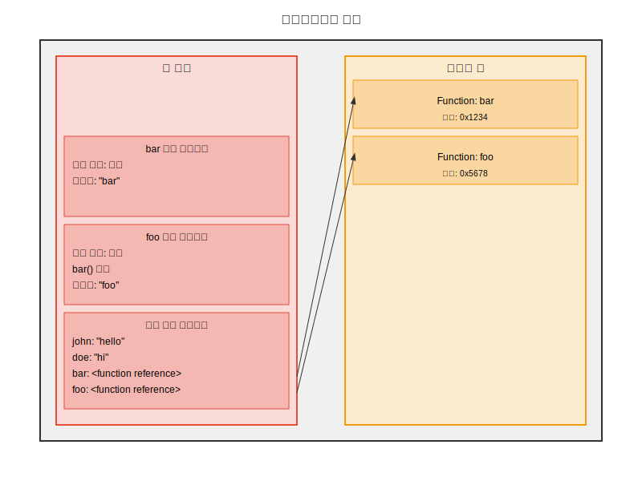

자바스크립트 엔진의 개략적인 구조도

자바스크립트는 싱글 스레드 기반의 언어이기 때문에 호출 스택을 한 번에 하나씩 처리해야 한다.


printSquare -> square -> multiply 의 순서대로 stack에 쌓이게 되고 역순으로 비워낸다.

개발중에 만날 수 있는 콜스텍 에러는 반복문이나 재귀함수의 코드 오류로 인해서 발생할 수 있는 에러라고 볼 수 있다.

```js
function foo() {
  foo();
}

foo();
```

를 실행하면 foo함수는 자기 자신을 재귀적으로 호출하면서 콜스택은 아래와 같이 쌓이게 된다.


해당 상황에 이르면 브라우저에서 콜스텍 에러를 내뱉게된다.

메모리 힙은 뭘까?
메모리 힙은 객체, 배열, 함수 등 참조 타입의 데이터를 저장한다.

원시값과 참조값의 구분이 여기서 이루어진다.
원시값의 데이터들은 콜스택의 실행 컨텍스트에서 이루어지고, 참조값의 변수는 힙 메모리의 주소가 저장된다.

```js
const john = "hello";
var doe = "hi";
function bar() {
  return "bar";
}

function foo() {
  bar();
  return "foo";
}

foo();
```

를 시각화하면 아래와 같이 진행된다.


